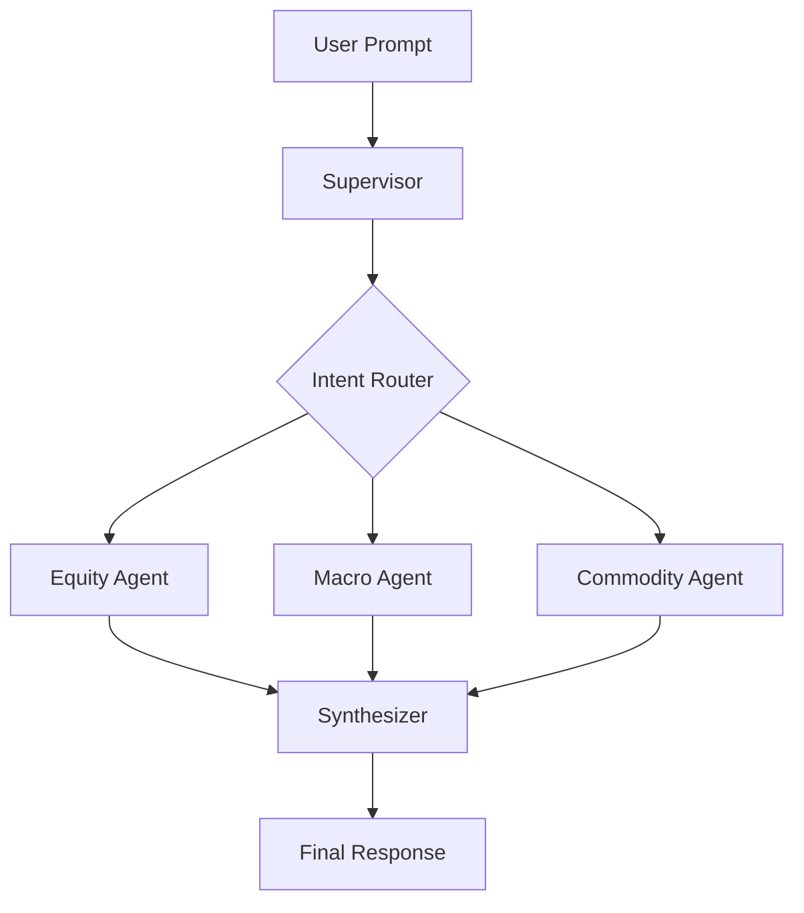

# AlphaSeeker

[](https://github.com/TZZheng/AlphaSeeker/actions/workflows/ci.yml)


Multi-agent quantitative research for equities, macro, and commodities.

AlphaSeeker takes a financial question, routes it to the right specialist agents, gathers real data through code, and returns a single synthesized report. The project is built for research workflows where you want more than a generic chatbot answer: you want domain routing, saved artifacts, charts, and a clearer trail of how the answer was produced.

## Table of Contents

- [Overview](#overview)
- [Why AlphaSeeker](#why-alphaseeker)
- [What It Can Do](#what-it-can-do)
- [How a Query Flows](#how-a-query-flows)
- [Quickstart](#quickstart)
- [Configuration](#configuration)
- [Example Prompts](#example-prompts)
- [Example Outputs](#example-outputs)
- [Project Structure](#project-structure)
- [Testing](#testing)
- [Current Limits](#current-limits)
- [Additional Reading](#additional-reading)
- [Contributing](#contributing)
- [License](#license)

## Overview

AlphaSeeker uses a supervisor-led architecture:

- The **supervisor** is the control layer. It reads the user prompt, decides which specialist should run, and combines the results.
- Each **sub-agent** is a domain-specific workflow for equity, macro, or commodity research.
- A final **synthesis** step merges one or more specialist outputs into a single answer.

In practical terms:

- `Analyze AAPL from valuation and risk perspective` should route to the equity agent.
- `US macro outlook for the next 12 months` should route to the macro agent.
- `How do higher rates affect JPM and bank margins?` can require both macro and equity work, then a final integrated answer.

## Why AlphaSeeker

| Typical finance chatbot | AlphaSeeker |
|---|---|
| One model answers everything | A supervisor routes work to domain-specific agents |
| Often relies on model memory | Pulls data through code and external data sources |
| Hard to inspect what happened | Saves reports, charts, and intermediate artifacts locally |
| Usually returns one flat response | Can combine multiple specialist reports into one final synthesis |

What makes the project interesting:

- **Cross-domain routing**: A single prompt can trigger multiple agents when the question spans company, macro, and commodity dimensions.
- **Deterministic data collection**: "Deterministic" here means key numbers are fetched by code from APIs or filings, instead of being invented by the model.
- **Provider-flexible model setup**: Model assignments are configurable by agent and by role, so you can trade off speed, quality, and cost.
- **Local-first artifacts**: Reports, charts, and fetched data are written to local folders for inspection and reuse.

## What It Can Do

| Domain | Core workflow | Data sources and tools | Typical output |
|---|---|---|---|
| Equity | Company analysis, valuation framing, risk review, peer context | `yfinance`, SEC filings, web search, report generation, charting | Markdown initiation report plus charts |
| Macro | Country and policy analysis, growth/inflation/rates context | FRED, World Bank, web research | Markdown macro brief |
| Commodity | Supply-demand analysis, positioning, futures curve interpretation | EIA, CFTC, futures data, web research | Markdown commodity report |

## How a Query Flows



High-level flow:

1. The supervisor classifies the prompt.
2. It creates one or more agent tasks.
3. Matching agents run, in parallel when needed.
4. The final synthesizer returns one response to the user.

If you are coming from systems or backend work: the shared "state" in this workflow is just the structured working memory passed from step to step.

## Quickstart

### 1. Prerequisites

- Python 3.11+
- [uv](https://docs.astral.sh/uv/)

### 2. Install dependencies

```bash
uv sync
```

### 3. Configure environment variables

```bash
cp .env.example .env
```

Fill only the keys required by the model providers and data sources you actually use.

### 4. Run AlphaSeeker

```bash
uv run python main.py
```

You will be prompted for a research question in the terminal.

## Configuration

### Model providers

Model assignments live in `config/models.yaml` and can be overridden with environment variables.

At startup, AlphaSeeker checks whether the API keys required by your active model choices are present.

| Provider model prefix | Required env var |
|---|---|
| `sf/` | `SILICONFLOW_API_KEY` |
| `kimi-` | `KIMI_API_KEY` |
| `gpt-` or `o*` | `OPENAI_API_KEY` |
| `gemini-` | `GOOGLE_API_KEY` |
| `claude-` | `ANTHROPIC_API_KEY` |

### Route-specific data keys

These are only needed when the corresponding route uses them:

- `FRED_API_KEY` for macro indicator fetches
- `EIA_API_KEY` for commodity inventory fetches
- `FMP_API_KEY` for insider-trading data

### Model override order

Model selection follows this priority:

1. `ALPHASEEKER_MODEL_<AGENT>_<ROLE>` environment variable override
2. `config/models.yaml`
3. Fallback defaults in `src/shared/model_config.py`

Example:

```bash
export ALPHASEEKER_MODEL_EQUITY_SECTION="kimi-k2.5"
```

If you are not used to the term "role" here: it means a specific job inside an agent pipeline, such as planning, summarization, or final section writing.

## Example Prompts

- `Analyze AAPL from valuation and risk perspective`
- `US macro outlook for the next 12 months`
- `Crude oil supply-demand and futures curve outlook`
- `How do higher rates affect JPM and bank margins?`
- `How would a weaker dollar affect gold miners and the gold price?`

## Example Outputs

Current sample artifacts in this repo:

- [AAPL equity report](reports/AAPL_initiation_report.md)
- [CRWV equity report](reports/CRWV_initiation_report.md)
- [Crude oil commodity report](reports/Commodity_Crude_Oil.md)
- [Supervisor crude oil synthesis](reports/Supervisor_US_Iran_Crude_Oil.md)

Runtime outputs are written to local folders and intentionally git-ignored where appropriate:

- `data/` for fetched datasets and debug artifacts
- `reports/` for generated Markdown reports
- `charts/` for generated chart images

## Project Structure

```text
AlphaSeeker/
├── main.py
├── config/
│   └── models.yaml
├── docs/
│   └── equity_agent.md
├── src/
│   ├── agents/
│   │   ├── equity/
│   │   ├── macro/
│   │   └── commodity/
│   ├── shared/
│   └── supervisor/
├── tests/
│   ├── unit/
│   ├── component/
│   └── live/
├── charts/
├── data/
├── reports/
├── CONTRIBUTING.md
├── SECURITY.md
├── TODO.md
├── pyproject.toml
└── uv.lock
```

## Testing

AlphaSeeker uses a layered pytest setup:

- `unit` tests for deterministic logic
- `component` tests for multi-function flows with mocked dependencies
- `live` tests for full runs against real providers

Run the local quality gate:

```bash
uv run python -m compileall -q src main.py
uv run pytest -m "not live"
```

Run the live suite:

```bash
uv run pytest -m "live"
```

GitHub Actions runs the offline suite on pushes and pull requests, and supports live test runs through manual dispatch.

If you are not used to the word "suite": it just means a grouped set of tests.

## Current Limits

- The main user interface is currently the terminal, not a web app.
- The equity path is the most documented route today; macro and commodity docs are still lighter.
- Sample output curation can be improved. The repo already contains real reports, but the visual showcase layer is still minimal.
- As with any LLM-based system, generated analysis should be reviewed before being used for investment decisions.

## Additional Reading

- [Equity sub-agent deep dive](docs/equity_agent.md)
- [Roadmap and next milestones](TODO.md)
- [Contribution guide](CONTRIBUTING.md)
- [Security policy](SECURITY.md)

## Contributing

See [CONTRIBUTING.md](CONTRIBUTING.md).

## License

MIT. See [LICENSE](LICENSE).
