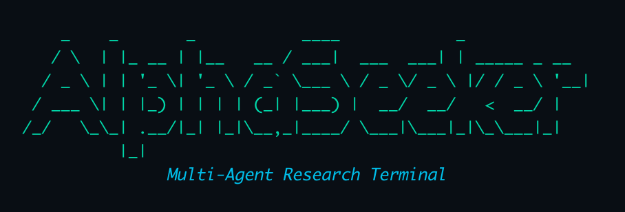

<p align="center">
  
</p>

<p align="center">
  <a href="https://github.com/TZZheng/AlphaSeeker/actions/workflows/ci.yml">
    
  </a>
  
  
  
</p>

# AlphaSeeker

**Multi-agent quantitative research — from question to comprehensive investment memo.**

AlphaSeeker is a file-based async multi-agent runtime. Give it a financial question — it spawns specialist agents, fetches real market data, builds charts, and synthesizes everything into a single well-structured report. The entire process is traceable: every agent workspace, every data fetch, every model call is written to disk.

No black boxes. No hallucinated numbers. Research that actually shows its work.

---

## What It Produces

Here is a real output from a single prompt: *"Write an investment memo on XOM."*

> **ExxonMobil is an exceptional company operating at the top of the global oil industry. Its asset portfolio — anchored by the Permian Basin, Guyana, and world-scale refining — is structurally advantaged, its balance sheet is fortress-quality, and its shareholder return commitment is unmatched among integrated majors. Yet the stock at approximately $160–162 per share presents a challenging near-term risk/reward.**
>
> **Investment verdict:** Hold/Underweight at current levels. A pullback to $130–140 would offer a materially better entry. Q1 2026 earnings (May 1, 2026) are a critical near-term catalyst.

The full memo covers: executive summary and verdict, FY2025 financials (revenue, FCF, ROCE), valuation (EV/EBITDA, P/E, FCF yield, analyst consensus), balance sheet quality, shareholder return analysis, crude oil supply/demand balance, WTI futures curve structure, U.S. macro backdrop, and bull/bear cases with 12-month risk/reward.

**[Read the full XOM memo →](docs/examples/assets/xom_investment_memo.md)**

---

## How It Works

```
User Prompt
    │
    ▼
Root Orchestrator Agent (subprocess)
    │  LLM decides: delegate? which skills? when done?
    ├─► spawns child agents (research, writer, synthesizer...)
    │       │
    │       ▼
    │   Skill Tools  ←  deterministic, no hallucination
    │       │  market data · SEC filings · FRED · EIA · CFTC
    │       ▼
    │   publish/  ← agent writes results here
    │
    ▼
Root reads child publish/ → synthesizes final memo
    │
    ▼
Final Report + full run trace on disk
```

Key design choices:

- **File-based handoff** — agents communicate by writing and reading files, not in-memory state. Every intermediate result is inspectable.
- **Subprocess isolation** — a crashed or stalled child agent cannot block the pipeline.
- **Skill packs** — deterministic tools organized by domain: core, equity, macro, commodity.
- **Commenter sidecar** — a paired reviewer reads each agent's workspace and injects advisory notes into the next turn.

---

## Why AlphaSeeker

| Typical finance research | AlphaSeeker |
|---|---|
| Relies on a single model's training data | Fetches live market data, SEC filings, EIA, FRED |
| You can't see how the answer was built | Every step is written to disk — inspect it all |
| One flat response | Multi-agent parallel research synthesized into one memo |
| Model can hallucinate numbers | Deterministic tools pull facts from external APIs |
| Fragile on slow I/O | Subprocess isolation — one slow tool doesn't block the pipeline |

---

## What It Can Research

| Domain | Skill tools | Typical output |
|---|---|---|
| **Equity** | Market data, company profile, financials, SEC filings, insider activity, peer analysis, earnings calls | Equity research memo with valuation, risk factors, peer context |
| **Macro** | FRED indicators, World Bank cross-country data | Macro brief covering growth, inflation, rates |
| **Commodity** | EIA inventory, CFTC COT positioning, futures curve | Commodity report with supply-demand analysis |
| **Core** | Web search, file read/write, context condensation, datetime | Used by all domains |

The orchestrator decides which combination to invoke — no manual routing required.

**Example prompts:**

```
Analyze AAPL from valuation and risk perspective
US macro outlook for the next 12 months
Crude oil supply-demand and futures curve outlook
How do higher rates affect JPM and bank margins?
How would a weaker dollar affect gold miners and the gold price?
```

---

## Quickstart

**Prerequisites:** Python 3.11+, [uv](https://docs.astral.sh/uv/)

```bash
# 1. Install dependencies
uv sync

# 2. Configure API keys
cp .env.example .env
# Edit .env and fill in the keys for the providers you use

# 3. Run
uv run python main.py "Write an investment memo on XOM"

# Or interactive mode
uv run python main.py
```

---

## Configuration

### Model providers

Model assignments live in `config/models.yaml`. Each provider requires a corresponding API key:

| Provider prefix | Required env var |
|---|---|
| `sf/` | `SILICONFLOW_API_KEY` |
| `kimi-` | `KIMI_API_KEY` |
| `minimax/` or `MiniMax-*` | `MINIMAX_API_KEY` |
| `gpt-` or `o*` | `OPENAI_API_KEY` |
| `gemini-` | `GOOGLE_API_KEY` |
| `claude-` | `ANTHROPIC_API_KEY` |

**Recommended: MiniMax.** In our testing MiniMax (M2.7) delivers the best research quality — strong multi-step reasoning, generous context window, and competitive cost. Set `MINIMAX_API_KEY` and the defaults in `config/models.yaml` will use it out of the box.

MiniMax endpoint defaults to `https://api.minimaxi.com/v1`. Override with `MINIMAX_BASE_URL` if needed.

### Data source keys

Only required when the corresponding skills are invoked:

| Key | Used for |
|---|---|
| `FRED_API_KEY` | Macro indicator fetches |
| `EIA_API_KEY` | Commodity inventory fetches |
| `FMP_API_KEY` | Insider-trading data |

### Model override

```bash
# Override any model role via env var
export ALPHASEEKER_MODEL_HARNESS_AGENT="claude-opus-4-5"
```

Priority: env var → `config/models.yaml` → fallback defaults in `src/shared/model_config.py`.

---

## Project Structure

```text
AlphaSeeker/
├── main.py                      # CLI entry point
├── config/
│   └── models.yaml              # Model assignments by role
├── src/
│   ├── harness/                 # Runtime: orchestrator, workers, skills
│   │   ├── runtime.py           # Async supervisor kernel
│   │   ├── agent_worker.py      # Long-lived worker process
│   │   ├── executor.py          # File-first tools (spawn, bash, read/write)
│   │   ├── transport.py         # MiniMax / OpenAI API adapters
│   │   ├── commenter.py         # Paired reviewer sidecar
│   │   └── skills/              # Deterministic skill adapters
│   │       ├── core.py          # search_in_files, read_file, condense…
│   │       ├── equity.py        # fetch_market_data, fetch_financials…
│   │       ├── macro.py         # fetch_macro_indicators…
│   │       └── commodity.py     # fetch_eia_inventory, fetch_cot_report…
│   ├── tools/                   # Shared data-fetching library
│   │   ├── equity/              # yfinance, SEC, peers, visualization
│   │   ├── macro/               # FRED, World Bank
│   │   └── commodity/           # EIA, CFTC COT, futures curve
│   └── shared/                  # LLM manager, model config, web search
├── data/harness_runs/           # Every run's full workspace (git-ignored)
└── tests/
    ├── unit/                    # Deterministic logic
    ├── component/               # Multi-function flows with mocked deps
    └── live/                    # Real API runs
```

---

## Testing

```bash
# Compile check + offline tests
uv run python -m compileall -q src main.py
uv run pytest -m "not live"

# Full live suite (requires API keys)
uv run pytest -m "live"
```

GitHub Actions runs the offline suite on every push and pull request.

---

## Further Reading

- [Harness runtime deep dive](src/harness/README.md) — architecture, workspace protocol, public interface
- [Harness task model](src/harness/TASK.md) — how tasks, artifacts, and skill state work
- [Roadmap](TODO.md)
- [Contributing](CONTRIBUTING.md)
- [Security policy](SECURITY.md)

---

## License

MIT. See [LICENSE](LICENSE).
