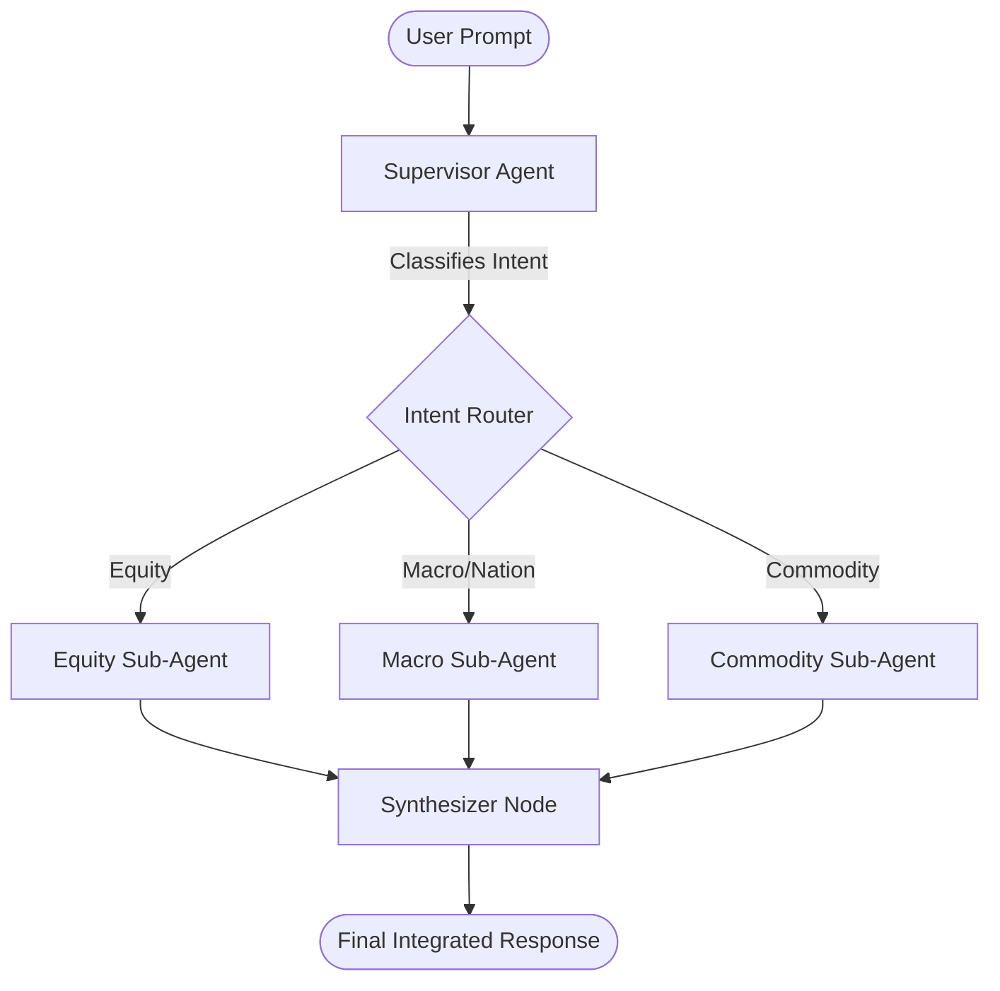

# AlphaSeeker: Multi-Agent Quantitative Research System

## Core Vision
AlphaSeeker is a **Multi-Agent Orchestration System**. The system features a top-level **Supervisor Agent** that acts as the intelligent routing and synthesis engine, managing a fleet of specialized **Sub-Agents**, where each sub-agent is a domain expert in a specific asset class or research methodology.

This architecture ensures scalability, high cohesion (sub-agents do one thing perfectly), and loose coupling (new asset classes or data sources can be easily added as independent agents).

## Architecture: Supervisor & Sub-Agents Pattern



### 1. Supervisor Agent
**Role:** The system's brain and orchestrator. It does not pull data directly. Instead, it:
1. Takes the natural language input.
2. Understands the underlying intent and required data constraints.
3. Delegates tasks to one or more appropriate sub-agents.
4. Synthesizes their individual outputs into a coherent final response.
- **Intent Router:** Determines whether the prompt is about equities, macroeconomic trends, commodities, or requires historical institutional research.
- **Synthesizer:** Merges reports. For example, if a user asks about "The impact of rising interest rates on JPMorgan," the Supervisor can call the **Macro Agent** (for rate trends) and the **Equity Agent** (for JPM financials) and merge their findings.

### 2. Specialized Sub-Agents

**Sub-Agent 1: Equity Research Agent (Current AlphaSeeker)**
- **Focus:** Single public companies (stocks). *(See [docs/equity_agent.md](docs/equity_agent.md) for full architecture and capabilities of this sub-agent)*
- **Capabilities:** Fetches pricing, company profiles, financials, SEC filings; conducts web research; generates CFA-standard initiation reports.
- **Upcoming Upgrades:** Earnings call analysis, insider trading tracking.

**Sub-Agent 2: Macro & Nation Agent (Planned)**
- **Focus:** Global economics, interest rates, inflation, employment, national policies.
- **Data Sources:** FRED API (Federal Reserve Economic Data), World Bank API, OECD.
- **Output:** Macro-outlook briefs and economic indicator summaries.

**Sub-Agent 3: Commodity Agent (Active)**
- **Focus:** Physical assets like Crude Oil, Gold, Copper, Agriculture.
- **Data Sources:** EIA (Energy Information Administration) inventory reports, CFTC Commitments of Traders (COT), futures curve data (contango/backwardation).
- **Output:** Supply/demand imbalances and price trend analysis.

## Project Structure

The folder layout mirrors the Supervisor + Sub-Agents architecture. Each sub-agent is a fully self-contained package. Shared infrastructure lives in `src/shared/`.

```
AlphaSeeker/
│
├── main.py                          # Entry point — CLI that routes user prompt to Supervisor
├── pyproject.toml                   # Project dependencies (managed by uv)
│
├── docs/
│   ├── equity_agent.md              # Deep-dive documentation for the Equity Sub-Agent
│   ├── macro_agent.md               # (Planned) Documentation for the Macro Sub-Agent
│   └── commodity_agent.md           # (Planned) Documentation for the Commodity Sub-Agent
│
├── src/
│   │
│   ├── supervisor/                  # Top-level orchestrator — routes and synthesizes
│   │   ├── __init__.py
│   │   ├── graph.py                 # LangGraph graph: intent router → sub-agents → synthesizer
│   │   ├── router.py                # Intent classification: maps prompt → EntityType enum
│   │   └── synthesizer.py           # LLM synthesis node: merges multi-agent outputs
│   │
│   ├── agents/                      # One sub-package per specialized sub-agent
│   │   │
│   │   ├── equity/                  # Sub-Agent 1: Equity Research (active)
│   │   │   ├── __init__.py
│   │   │   ├── graph.py             # LangGraph graph: 12-node equity research pipeline
│   │   │   ├── nodes.py             # All node functions (planner, fetch, research, generate, etc.)
│   │   │   ├── schemas.py           # Equity-specific Pydantic models (AnalysisPlan, ResearchReport)
│   │   │   └── tools/
│   │   │       ├── __init__.py
│   │   │       ├── market_data.py   # OHLCV price history via yfinance
│   │   │       ├── company_profile.py # Company identity, ownership, institutional holders
│   │   │       ├── financials.py    # Income, balance sheet, cash flow, TTM, key ratios
│   │   │       ├── peers.py         # Peer discovery and comparison table
│   │   │       ├── sec_filings.py   # SEC EDGAR: 10-K, 10-Q, 8-K text extraction
│   │   │       ├── visualization.py # Price + volume chart generator (matplotlib)
│   │   │       └── analysis.py      # Financial ratio and analysis utilities
│   │   │
│   │   ├── macro/                   # Sub-Agent 2: Macro & Nation (planned)
│   │   │   ├── __init__.py
│   │   │   ├── graph.py             # LangGraph graph for macro research pipeline
│   │   │   ├── nodes.py             # Node functions (fetch indicators, write macro brief)
│   │   │   ├── schemas.py           # Macro-specific Pydantic models (MacroPlan, MacroReport)
│   │   │   └── tools/
│   │   │       ├── __init__.py
│   │   │       ├── fred.py          # FRED API: interest rates, CPI, GDP, employment data
│   │   │       └── world_bank.py    # World Bank API: cross-country economic indicators
│   │   │
│   │   └── commodity/               # Sub-Agent 3: Commodity (active)
│   │       ├── __init__.py
│   │       ├── graph.py             # LangGraph graph for commodity research pipeline
│   │       ├── nodes.py             # Node functions (fetch supply/demand, write report)
│   │       ├── schemas.py           # Commodity-specific Pydantic models (CommodityReport)
│   │       └── tools/
│   │           ├── __init__.py
│   │           ├── eia.py           # EIA API: oil and gas inventory reports
│   │           ├── cftc.py          # CFTC COT reports: speculative long/short positioning
│   │           └── futures.py       # Futures curve data (contango / backwardation)
│   │
│   └── shared/                      # Infrastructure shared across all agents
│       ├── __init__.py
│       ├── llm_manager.py           # LLM registry, RateLimitWrapper, and model fallback chain
│       ├── schemas.py               # Cross-agent Pydantic models: SubAgentRequest, SubAgentResponse
│       └── web_search.py            # DDG + trafilatura search — imported directly by all agents
│
├── reports/                         # Generated Markdown research reports (output)
├── charts/                          # Generated price charts PNG (output)
├── data/                            # Cached CSV and Markdown data files (runtime cache)
│
└── tests/
    ├── test_supervisor.py           # Tests for intent routing and final synthesis
    ├── agents/
    │   ├── test_equity_agent.py     # Tests for the equity research pipeline
    │   ├── test_macro_agent.py      # (Planned) Tests for the macro pipeline
    │   └── test_commodity_agent.py  # (Planned) Tests for the commodity pipeline
    └── shared/
        ├── test_llm_manager.py      # Tests for LLM fallback and rate-limit handling
        └── test_schemas.py          # Pydantic model validation tests
```

### Key Design Principles

| Principle | Implementation |
|-----------|----------------|
| **Isolation** | Each sub-agent in `agents/*/` owns its own graph, nodes, schemas, and tools. No cross-agent imports. |
| **Shared Infrastructure** | `src/shared/` holds code used by all agents: LLM manager, base web search, and cross-agent schemas. |
| **Uniform Interface** | All sub-agents accept `SubAgentRequest` and return `SubAgentResponse` (defined in `shared/schemas.py`), so the Supervisor can call any agent identically. |
| **Independent Extensibility** | Adding a new sub-agent means creating a new folder `agents/<domain>/` without modifying any existing agent. |
