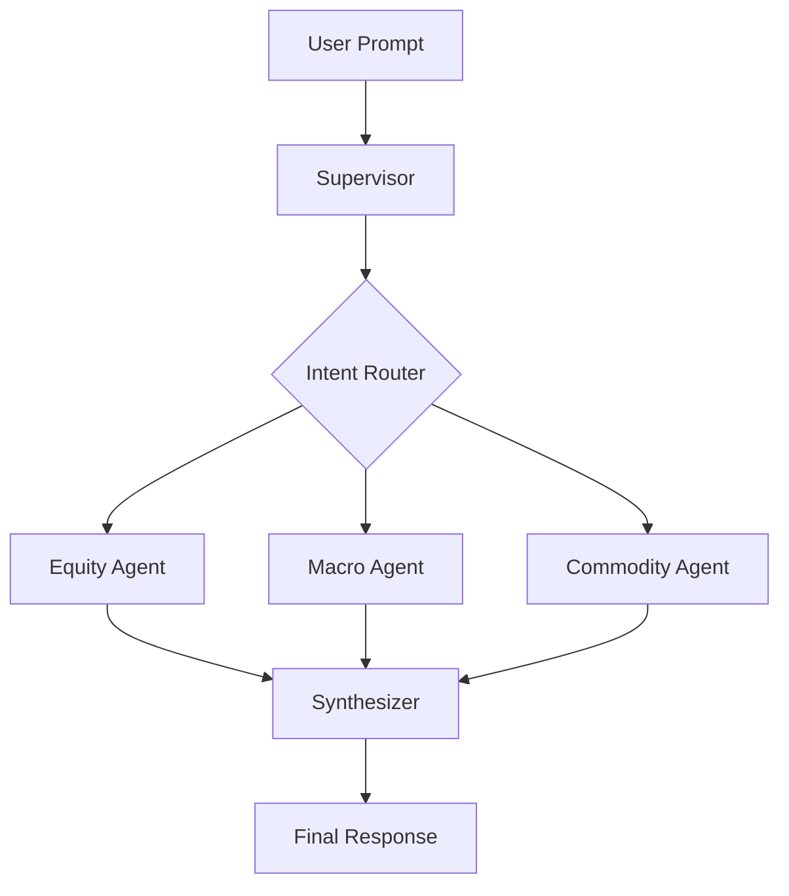

# AlphaSeeker

AlphaSeeker is a multi-agent quantitative research system.
A supervisor agent routes user intent to specialized sub-agents, then synthesizes a single final response.

Current domains:
- Equity research
- Macro research
- Commodity research

## Why this architecture

The project uses a supervisor + sub-agent pattern:
- The **Supervisor** classifies intent and orchestrates execution.
- Each **Sub-Agent** owns one domain and runs an independent pipeline.
- A final synthesis step merges results into one output.



## Quickstart

### 1. Prerequisites
- Python 3.11+
- [uv](https://docs.astral.sh/uv/)

### 2. Install dependencies
```bash
uv sync
```

### 3. Configure environment variables
```bash
cp .env.example .env
```
Fill only the keys required by your configured model providers.

### 4. Run
```bash
uv run python main.py
```

## API key requirements

Model providers are configured in `config/models.yaml` (and can be overridden by env vars).
At startup, AlphaSeeker validates required provider API keys based on active model assignments.

| Provider model prefix | Required env var |
|---|---|
| `sf/` | `SILICONFLOW_API_KEY` |
| `kimi-` | `OPENAI_API_KEY` |
| `gemini-` | `GOOGLE_API_KEY` |

Data-source keys are route-dependent (not always needed):
- `FRED_API_KEY` for macro indicator fetches
- `EIA_API_KEY` for commodity inventory fetches
- `FMP_API_KEY` for insider-trading data

## Example prompts

- `Analyze AAPL from valuation and risk perspective`
- `US macro outlook for the next 12 months`
- `Crude oil supply-demand and futures curve outlook`
- `How do higher rates affect JPM and bank margins?`

## Project structure

```text
AlphaSeeker/
├── main.py
├── config/
│   └── models.yaml
├── docs/
│   └── equity_agent.md
├── src/
│   ├── supervisor/
│   ├── agents/
│   │   ├── equity/
│   │   ├── macro/
│   │   └── commodity/
│   └── shared/
├── TODO.md
├── pyproject.toml
└── uv.lock
```

Runtime outputs are written to local cache/output folders and are intentionally git-ignored:
- `data/`
- `reports/`
- `charts/`

## Model configuration

Model assignment resolution order:
1. `ALPHASEEKER_MODEL_<AGENT>_<ROLE>` env override
2. `config/models.yaml`
3. hardcoded defaults in `src/shared/model_config.py`

Example override:
```bash
export ALPHASEEKER_MODEL_EQUITY_SECTION="kimi-k2.5"
```

## Development status

- Core multi-agent flow is implemented.
- Testing harness is still in progress (see `TODO.md`).
- Current local quality gate:
```bash
python -m compileall -q src main.py
```

## Security and publishing notes

- Never commit `.env` or API keys.
- Local/editor artifacts (`.DS_Store`, `.agent/`, `.venv/`) are git-ignored.
- Review diffs before push, especially around config and credentials.
- See `SECURITY.md` for responsible vulnerability disclosure.

## Roadmap

See `TODO.md` for planned work and next milestones.

## Contributing

See `CONTRIBUTING.md`.

## License

MIT. See `LICENSE`.
