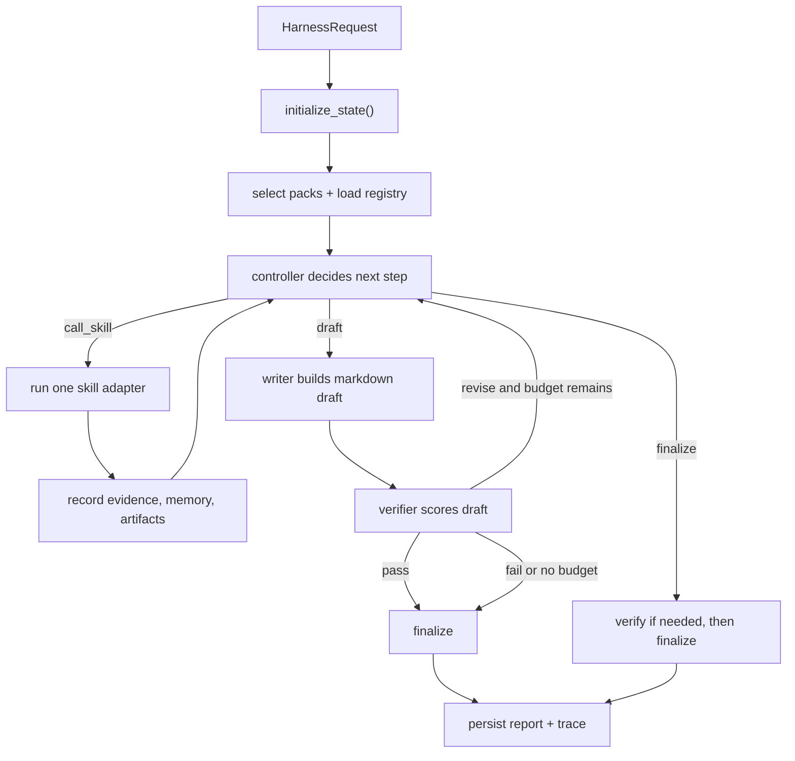

# Harness

The harness is AlphaSeeker's experimental bounded research runtime. Instead of sending a prompt through the legacy supervisor graph, it runs a smaller control loop:

1. choose a small next action,
2. execute one skill,
3. draft an answer,
4. verify the draft,
5. revise if needed,
6. persist both the final report and a machine-readable trace.

This folder contains that runtime and the skill adapters it can call.

## Why This Exists

The legacy runtime in AlphaSeeker is a graph of domain agents. The harness is a simpler orchestration layer for side-by-side experimentation:

- It keeps the loop explicit and bounded with `max_steps`.
- It records a full trace of controller decisions, skill results, evidence, drafts, and verifier feedback.
- It makes it easy to inject stub components in tests through plain Python function arguments.
- It reuses the existing data-collection tools from the equity, macro, and commodity agents instead of rebuilding those integrations.

If you are coming from backend terminology:

- "orchestration" means the control logic that decides what runs next.
- "bounded loop" means the runtime has explicit stop limits, so it cannot keep iterating forever.
- "trace" means a structured execution log saved as JSON.
- "artifact" means a saved local file such as a CSV, JSON, PNG, or Markdown report.

## Folder Map

| File | Purpose |
| --- | --- |
| `__init__.py` | Public import surface: `HarnessRequest`, `HarnessResponse`, `run_harness`. |
| `types.py` | Pydantic data contracts for requests, state, evidence, skill results, and verification reports. |
| `runtime.py` | Main control loop: initialize state, run skills, draft, verify, revise, and persist outputs. |
| `selector.py` | Chooses which skill packs to enable for a prompt. |
| `registry.py` | Builds the skill registry and filters skills by enabled pack. |
| `controller.py` | Decides the next action: `call_skill`, `draft`, or `finalize`. |
| `writer.py` | Produces the user-facing Markdown draft from the evidence ledger. |
| `verifier.py` | Judges the draft for grounding, citations, completeness, and formatting. |
| `skills/` | Skill adapters grouped into `core`, `equity`, `macro`, and `commodity` packs. |

## High-Level Flow



Important current behavior:

- The harness executes one skill call per loop iteration.
- It can use multiple packs in one run, but it does not currently run harness skills in parallel.
- `core` is always enabled, even if the caller only requests `equity`, `macro`, or `commodity`.

## Entry Points

### CLI

From the repo root:

```bash
uv run python main.py --runtime harness
```

`main.py` reads a prompt from stdin, calls `run_harness(HarnessRequest(user_prompt=query))`, then prints the final response, enabled packs, skills used, and saved file paths.

### Python API

```python
from src.harness import HarnessRequest, run_harness

response = run_harness(
    HarnessRequest(
        user_prompt="Analyze AAPL valuation and risk using current evidence.",
        selected_packs=["equity"],
        max_steps=8,
        max_revision_rounds=2,
    )
)

print(response.status)
print(response.final_response)
print(response.report_path)
print(response.trace_path)
```

Notes:

- Passing `selected_packs=["equity"]` still enables `core`.
- If `selected_packs` is omitted, the harness asks the selector to infer the packs from the prompt.
- The `runtime` field on `HarnessRequest` is metadata. The actual CLI runtime switch is `--runtime harness`.

## Core Contracts

The harness is built around a few typed models in `types.py`.

### `HarnessRequest`

This is the input contract for a run.

| Field | Default | Meaning |
| --- | --- | --- |
| `user_prompt` | required | Raw user request. |
| `runtime` | `"harness"` | Metadata label for the request. |
| `max_steps` | `12` | Hard upper bound on controller iterations. |
| `max_revision_rounds` | `2` | How many verifier-driven rewrite loops are allowed. |
| `max_chars_before_condense` | `6000` | If a skill output exceeds this size, the runtime condenses it before storing it in working memory and the trace. |
| `selected_packs` | `None` | Optional manual override for pack selection. |

### `HarnessState`

This is the mutable run state carried through the loop. In systems terms, this is the in-memory state container for the workflow. It includes:

- `enabled_packs`: the packs that are active for this run.
- `available_skills`: the filtered list of `SkillSpec` entries.
- `evidence_ledger`: the normalized evidence store used to ground the draft.
- `skill_history`: every executed skill result, including `ok`, `partial`, and `failed`.
- `controller_log`: every controller decision.
- `verification_reports`: every verifier pass.
- `working_memory`: short text summaries of what happened so far.
- `revision_notes`: verifier critiques carried into later drafts.
- `artifacts`: unique saved file paths collected from skills.
- `latest_draft`, `final_response`, `status`, `error`, and saved output paths.

### `EvidenceItem`

An `EvidenceItem` is the atomic unit of grounding. Each entry has:

- an `id` like `E1`, `E2`, ...
- the producing `skill_name`,
- a `source_type` of `url`, `artifact`, `dataset`, or `note`,
- a short `summary`,
- optional `content`,
- optional source URLs or artifact paths,
- optional free-form `metadata`.

The runtime assigns evidence IDs automatically when a skill result is recorded.

### `SkillSpec` and `SkillResult`

`SkillSpec` is the registry definition for a public harness skill. It includes:

- `name`,
- `description`,
- `pack`,
- `input_schema`,
- whether it `produces_artifacts`,
- timeout metadata,
- the Python `executor`.

`input_schema` here is descriptive metadata, not enforced runtime validation. In backend terms, think of it as a lightweight interface description rather than a strict request validator.

`SkillResult` is the normalized output from a skill call:

- `status`: `ok`, `partial`, or `failed`
- `summary`
- optional `structured_data`
- optional `output_text`
- optional `artifacts`
- optional `evidence`
- optional `error`

### `VerificationReport`

This is the judge output from `verifier.py`. It scores:

- `grounding`
- `completeness`
- `numeric_consistency`
- `citation_coverage`
- `formatting`

Each category is `pass`, `revise`, or `fail`. The overall `decision` is also one of those values.

"LLM-as-a-judge" just means a second model pass used for quality control, not for primary research.

### `HarnessResponse`

This is the final public return value from `run_harness`. It includes:

- `final_response`
- `status`
- `report_path`
- `trace_path`
- final `verification`
- `enabled_packs`
- `skills_used`
- `artifacts`

## Runtime Semantics

The main loop lives in `runtime.py`. The easiest way to understand it is as a small state machine.

### 1. Initialization

`initialize_state()`:

- builds the registry,
- chooses packs from `selected_packs` or `select_packs()`,
- prepends `core`,
- removes duplicates while preserving order,
- filters the available skills to those packs.

If the resulting skill list is empty, the run fails immediately and still writes output files.

### 2. Controller step

Each iteration increments `state.step_count`, asks the controller for a `ControllerDecision`, and appends that decision to `controller_log`.

The only legal actions are:

- `call_skill`
- `draft`
- `finalize`

If `action="call_skill"`, `skill_call` must be present. `types.py` enforces that rule with a Pydantic validator.

### 3. Skill execution

When the controller asks for a skill:

- the runtime looks up the skill in the registry,
- calls its executor,
- catches exceptions and converts them into a failed `SkillResult`,
- records the result with `_record_skill_result()`.

Recording a skill result does several things:

- assign missing evidence IDs,
- condense `output_text` if it is too long,
- append the result to `skill_history`,
- extend the `evidence_ledger`,
- deduplicate artifact paths into `state.artifacts`,
- append a summary plus optional text snippet to `working_memory`,
- copy the error into `state.error` if the skill failed.

Two subtle but important points:

- A failed or partial skill does not automatically abort the run.
- Unknown skill names are converted into failed `SkillResult` entries instead of raising.

### 4. Drafting

When the controller chooses `draft`, the writer produces Markdown from:

- the original user prompt,
- recent revision notes,
- recent working memory,
- recent evidence.

The writer instructs the model to cite evidence IDs inline like `[E1]`.

### 5. Verification and revision

After drafting, the verifier runs immediately.

- If verification returns `pass`, the draft is finalized.
- If verification returns `revise` and revision budget remains, the runtime stores the critique in `revision_notes` and continues the loop.
- If revision budget is exhausted, the current draft is finalized as-is.

The `finalize` action is not a blind exit. If the latest draft has not been verified, or the latest verification still says `revise`, the runtime runs the verifier again before exiting.

### 6. Persistence

Every run writes two files relative to the current working directory:

- `reports/<prompt-derived-name>.md`
- `data/harness_runs/<prompt-derived-name>.json`

If you run the harness through `main.py` from the repo root, those land in the repo's `reports/` and `data/harness_runs/` folders. If you change the working directory before calling `run_harness`, the outputs follow that working directory instead.

## Selector Behavior

`selector.py` is intentionally small. It does not implement a separate classification model today. Instead it reuses `src.supervisor.router.classify_user_prompt()` and maps the returned agent tasks to harness packs.

Current behavior:

- recognized domain packs are `equity`, `macro`, and `commodity`
- `core` is always included
- cross-domain prompts can enable multiple packs
- if classification throws an exception, the selector falls back to all packs: `["core", "equity", "macro", "commodity"]`

That fallback is conservative: it increases coverage at the cost of giving the controller more skills to choose from.

## Controller, Writer, and Verifier Fallbacks

The harness has explicit degraded-mode behavior when model calls fail.

### Controller fallback

If `controller.py` cannot get a structured model output:

- it tries to gather evidence first,
- prefers `search_and_read` if available,
- otherwise falls back to `search_web`,
- drafts once enough evidence exists,
- finalizes a passing verified draft,
- uses verifier critique to trigger another `search_and_read` round when possible.

### Writer fallback

If `writer.py` cannot get a model response, it writes a simple Markdown answer with:

- a title,
- an answer section,
- a grounded summary of recent evidence,
- a sources section.

### Verifier fallback

If `verifier.py` cannot get a model response, it uses rules:

- empty draft -> `fail`
- no evidence -> `revise`
- evidence exists but no cited evidence IDs -> `revise`
- evidence exists and cited IDs appear in the draft -> `pass`

This makes the harness reasonably testable offline.

## Automatic Condensation

Large skill outputs are condensed automatically in `_maybe_condense_output()`.

What happens:

- if `output_text` length is at most `max_chars_before_condense`, nothing changes
- otherwise `src.shared.text_utils.condense_context()` is called with `agent="harness"`
- the shortened output replaces the original `output_text`
- the summary is updated to note the size reduction
- `structured_data["condensed"] = True` is added with before/after character counts

This protects `working_memory`, the trace, and later model prompts from ballooning.

`read_artifact` also uses `read_file_safe()`, which can condense large files during read time.

## Skill Packs

The registry is built in `registry.py` from the lists exported by `skills/__init__.py`.

### Core pack

These skills are always available.

| Skill | What it does | Typical use |
| --- | --- | --- |
| `search_web` | Returns web URLs and snippets for a query. | Early discovery when the controller needs candidate sources. |
| `search_news` | Returns recent news URLs and snippets. | News-sensitive prompts. |
| `search_and_read` | Runs search, downloads top pages, and extracts full text or snippets. | Main evidence collection path. |
| `condense_context` | Summarizes long text while trying to preserve names, dates, and numbers. | Compressing prior output before another reasoning step. |
| `read_artifact` | Reads a local file into the harness context. | Reusing a saved report, chart metadata file, or dataset excerpt. |

### Equity pack

These adapters wrap tools from `src/agents/equity/tools/`.

| Skill | What it does |
| --- | --- |
| `fetch_market_data` | Fetches historical OHLCV market data for a ticker. |
| `plot_price_history` | Creates a price chart from saved market data. |
| `fetch_company_profile` | Fetches company profile, sector, industry, and ownership fields. |
| `fetch_financials` | Fetches financial statements and ratios. |
| `search_sec_filings` | Searches and reads recent SEC filings. |
| `fetch_insider_activity` | Fetches recent insider-trading activity. |
| `research_earnings_call` | Collects recent earnings-call evidence and notes. |
| `analyze_peers` | Extracts peer candidates from prior text, categorizes them, and saves a peer-comparison artifact. |

If you are not used to market-data jargon, "OHLCV" means open, high, low, close, and volume for each trading period.

### Macro pack

These adapters wrap tools from `src/agents/macro/tools/`.

| Skill | What it does |
| --- | --- |
| `fetch_macro_indicators` | Pulls FRED-based macro indicators for a topic and country set. |
| `fetch_world_bank_indicators` | Pulls cross-country World Bank indicator tables. |

### Commodity pack

These adapters wrap tools from `src/agents/commodity/tools/`.

| Skill | What it does |
| --- | --- |
| `fetch_eia_inventory` | Pulls EIA inventory and production data for an energy commodity. |
| `fetch_cot_report` | Pulls CFTC Commitment of Traders positioning. |
| `fetch_futures_curve` | Pulls futures-curve structure for a commodity. |

If you are not used to commodities jargon:

- "COT" means the Commitment of Traders report, which summarizes futures positioning by trader category.
- "futures curve" means prices across delivery months, which is useful for spotting backwardation or contango.

## Output Files

### Report

The report is the final Markdown answer written to `reports/`.

### Trace

The trace is a JSON snapshot written to `data/harness_runs/`. It includes:

- serialized request metadata,
- enabled packs,
- available skill specs,
- controller decisions,
- full skill history,
- evidence ledger,
- verification reports,
- working memory,
- revision notes,
- artifact paths,
- latest draft,
- final response,
- step and revision counts,
- status and error fields,
- saved file paths.

Minimal shape:

```json
{
  "request": {
    "user_prompt": "Analyze AAPL",
    "runtime": "harness"
  },
  "enabled_packs": ["core", "equity"],
  "controller_log": [
    {
      "action": "call_skill",
      "rationale": "Gather evidence",
      "skill_call": {
        "name": "search_and_read",
        "arguments": {
          "queries": ["Analyze AAPL"]
        }
      }
    }
  ],
  "skill_history": [],
  "evidence_ledger": [],
  "verification_reports": [],
  "step_count": 1,
  "revision_count": 0,
  "status": "running"
}
```

This trace is the best place to debug controller behavior or inspect what evidence the final answer was based on.

## Model Configuration

Harness model roles live in `config/models.yaml` under the `harness:` section:

- `controller`
- `condense`
- `writer`
- `verify`

There is also a `selector` entry in the config, but the current selector implementation delegates to the supervisor classifier rather than calling a separate harness-specific selector model directly.

As in the rest of the repo, environment variables can override configured models:

```bash
export ALPHASEEKER_MODEL_HARNESS_CONTROLLER="kimi-k2.5"
export ALPHASEEKER_MODEL_HARNESS_WRITER="kimi-k2.5"
```

The harness inherits the same provider-key checks done at startup by `main.py`.

## Testing

Harness coverage is split across unit, component, and live tests.

### Unit tests

Focused on deterministic pieces:

- pack selection
- registry filtering
- type validation
- fallback verifier behavior

Run:

```bash
uv run pytest tests/unit/test_harness_selector_and_registry.py tests/unit/test_harness_types_and_verifier.py
```

### Component tests

These inject stub registries and fake controller/writer/verifier functions into `run_harness()`. In backend terms, this is dependency injection: supplying test doubles instead of the real runtime dependencies.

The component tests confirm:

- single-domain runs persist reports and traces,
- cross-domain runs can record multiple skills,
- partial skill results are preserved,
- verifier critique can trigger another research round,
- large outputs are condensed,
- revision budgets are enforced.

Run:

```bash
uv run pytest tests/component/test_harness_runtime.py tests/component/test_main_runtime_switch.py
```

### Live smoke test

`tests/live/test_live_harness_smoke.py` performs a capped real run with network and model access. It limits search scope to keep the test small.

Run:

```bash
uv run pytest -m "live and network" tests/live/test_live_harness_smoke.py
```

## Extending the Harness

The normal path for adding a skill is:

1. implement the adapter function in the relevant file under `skills/`
2. return a normalized `SkillResult`
3. register a `SkillSpec` in that pack's skill list
4. add tests that cover both successful and degraded behavior
5. update this README if the public skill surface changes

Guidelines from the current code:

- Prefer returning `partial` over `failed` when some useful information was produced.
- Add evidence whenever possible. The writer and verifier are much more useful when the ledger is populated.
- Use `artifact_evidence`, `url_evidence`, and `note_evidence` from `skills/common.py` instead of hand-building inconsistent payloads.
- If the skill can produce long text, either rely on runtime condensation or explicitly keep the output focused.
- Keep argument names simple and concrete; the controller prompt encourages minimal argument payloads.

If you add a new domain pack, you also need to update:

- `selector.py`
- `PACK_ORDER`
- `_DOMAIN_PACKS`
- `skills/__init__.py`
- `registry.py`
- tests that assert known packs and registry contents

## Known Limits

- The harness is sequential at the skill level. Multiple domains can be enabled, but each loop iteration executes only one skill.
- Pack selection currently depends on the supervisor classifier.
- `SkillSpec.input_schema` is descriptive, not a strict validator.
- The writer and verifier use only the recent slice of evidence and memory, not the full historical ledger.
- There is no dedicated harness CLI beyond `main.py --runtime harness`.
- The harness is still experimental, so the trace format should be treated as useful internal data rather than a stable external API.

## Suggested Reading Order

If you are new to this folder, read the files in this order:

1. `types.py`
2. `runtime.py`
3. `controller.py`
4. `writer.py`
5. `verifier.py`
6. `skills/core.py`
7. the domain skill files you care about

That sequence mirrors the main execution path and is the fastest way to build a correct mental model of the runtime.
